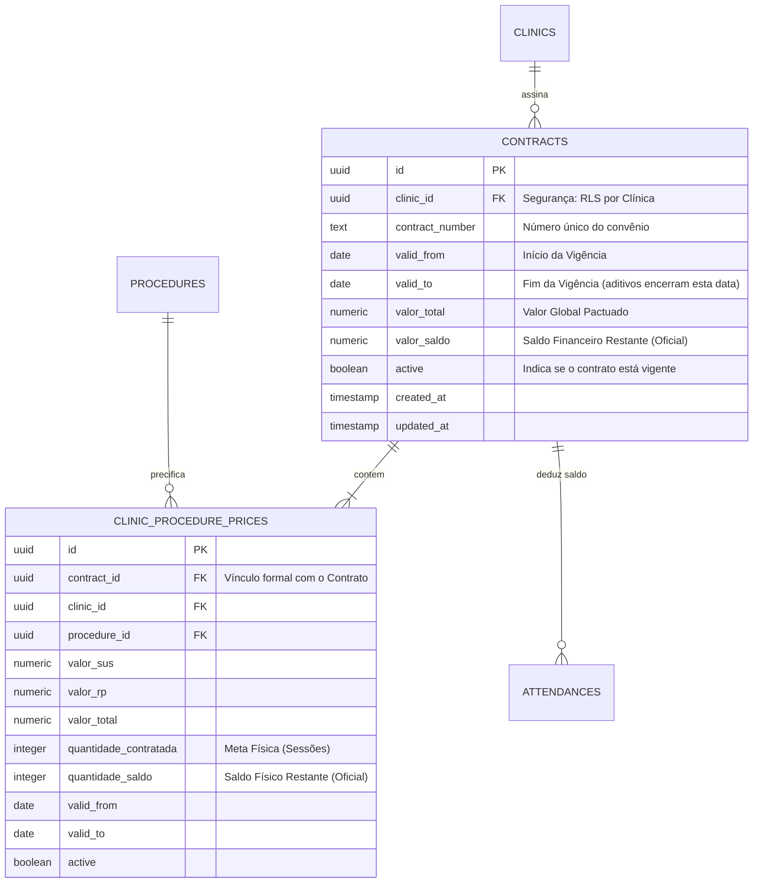
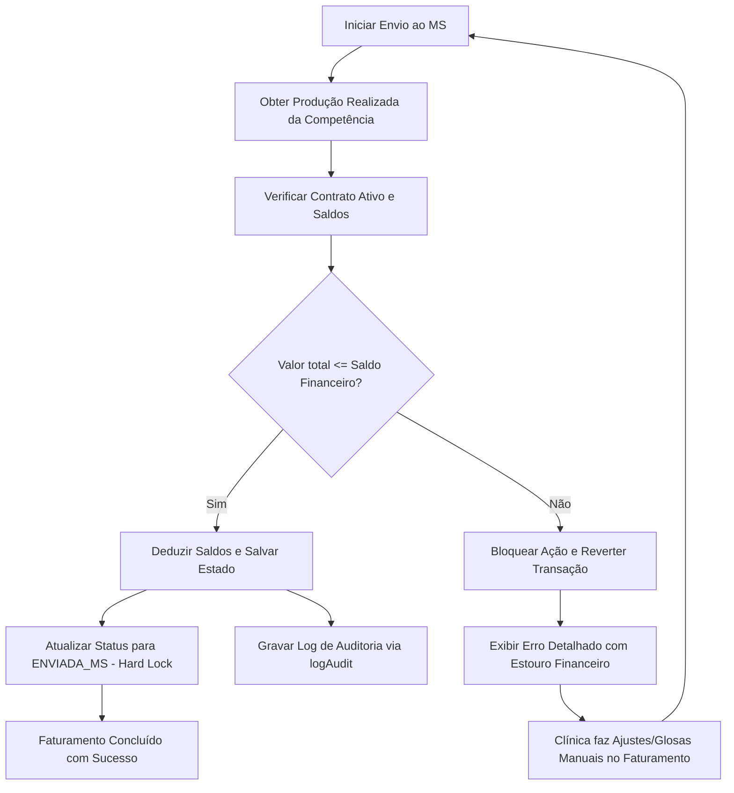
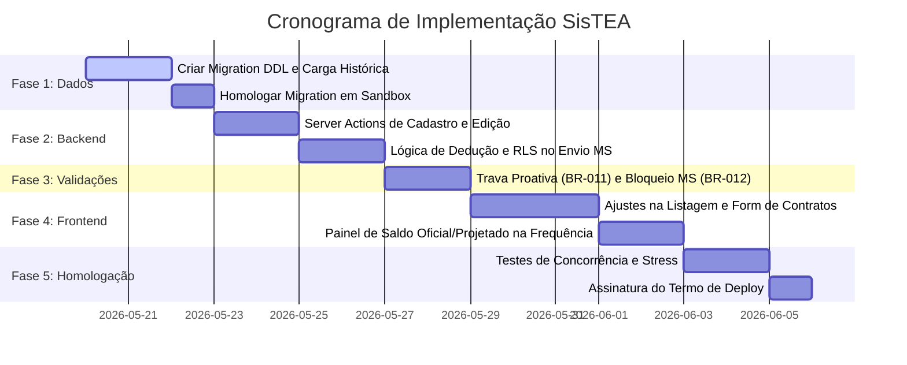

# Estudo Técnico de Viabilidade (Reanálise): Controle de Saldos de Contratos e Itens

Este documento apresenta a reanálise técnica e o plano de ação refinado para a implementação do controle de saldo financeiro (valor global do contrato) e operacional (quantidade por procedimento) no **SisTEA**. 

Como analista sênior, esta revisão foca em garantir **desempenho máximo, segurança absoluta dos dados (RLS e auditoria forense) e estabilidade operacional**, eliminando qualquer risco de regressão no faturamento ativo das clínicas credenciadas.

> [!IMPORTANT]
> **Diretrizes Homologadas nesta Reanálise (Revisado em 19/05/2026):**
> 1. **Estouro na Homologação (BR-012):** O sistema **bloqueará o envio ao Ministério da Saúde** apenas em caso de estouro de saldo financeiro global do contrato. Para o saldo físico de quantidade por procedimento, o envio é permitido e o saldo do item pode ficar negativo, acomodando flutuações normais na demanda de procedimentos da clínica.
> 2. **Aditivos Contratuais (BR-013):** Aditivos contratuais de valor ou quantidade **não** sobrescrevem registros antigos. Eles criam vigências complementares (histórico imutável), finalizando o contrato antigo e iniciando o aditivado com herança de saldos, preservando a rastreabilidade forense das contas públicas.
> 3. **Sem Efeitos Colaterais:** Nenhuma linha de código ou banco de dados será alterada nesta etapa. Este documento é o plano final para aprovação da governança.

---

## 1. Nova Arquitetura de Banco de Dados (3NF Hardened)

A fim de suportar a modelagem em Terceira Forma Normal (3NF) sem redundâncias e assegurar políticas de segurança (*Row Level Security - RLS*), estruturamos a tabela dedicada de `contracts` e o relacionamento com os itens do contrato (`clinic_procedure_prices`).



### Script DDL de Migração (Zero-Downtime e Retrocompatível)

Este script migra de forma totalmente transparente e automática os contratos antigos (agrupados por número de contrato textual) para a nova estrutura sem interromper o funcionamento atual:

```sql
-- ==========================================
-- FASE 1: CRIAÇÃO DA TABELA DE CONTRATOS
-- ==========================================
CREATE TABLE public.contracts (
    id UUID PRIMARY KEY DEFAULT gen_random_uuid(),
    clinic_id UUID NOT NULL REFERENCES public.clinics(id) ON DELETE CASCADE,
    contract_number TEXT NOT NULL,
    valid_from DATE NOT NULL,
    valid_to DATE,
    valor_total NUMERIC(12, 2) NOT NULL DEFAULT 0,
    valor_saldo NUMERIC(12, 2) NOT NULL DEFAULT 0,
    active BOOLEAN NOT NULL DEFAULT true,
    created_at TIMESTAMP WITH TIME ZONE DEFAULT timezone('utc'::text, now()) NOT NULL,
    updated_at TIMESTAMP WITH TIME ZONE DEFAULT timezone('utc'::text, now()) NOT NULL,
    CONSTRAINT unique_clinic_contract UNIQUE (clinic_id, contract_number)
);

-- Habilitar RLS Rígido (Padrão de Segurança SisTEA)
ALTER TABLE public.contracts ENABLE ROW LEVEL SECURITY;

CREATE POLICY "Admin full access contracts" 
ON public.contracts FOR ALL USING (public.get_user_role() = 'SMS_ADMIN');

CREATE POLICY "Users view own contracts" 
ON public.contracts FOR SELECT USING (clinic_id = public.get_user_clinic_id());

-- ==========================================
-- FASE 2: ADAPTAÇÃO DOS PREÇOS (ITENS DO CONTRATO)
-- ==========================================
ALTER TABLE public.clinic_procedure_prices
ADD COLUMN contract_id UUID REFERENCES public.contracts(id) ON DELETE SET NULL,
ADD COLUMN quantidade_contratada INTEGER NOT NULL DEFAULT 0,
ADD COLUMN quantidade_saldo INTEGER NOT NULL DEFAULT 0;

-- ==========================================
-- FASE 3: MIGRAR DADOS HISTÓRICOS AUTOMATICAMENTE
-- ==========================================
DO $$
DECLARE
    rec RECORD;
    v_contract_id UUID;
    v_valid_from DATE;
    v_valid_to DATE;
BEGIN
    FOR rec IN 
        SELECT DISTINCT clinic_id, contract_number 
        FROM public.clinic_procedure_prices 
        WHERE contract_number IS NOT NULL AND contract_number <> ''
    LOOP
        -- Identificar os extremos de validade dos procedimentos vinculados
        SELECT MIN(valid_from), MAX(valid_to)
        INTO v_valid_from, v_valid_to
        FROM public.clinic_procedure_prices
        WHERE clinic_id = rec.clinic_id AND contract_number = rec.contract_number;

        -- Inserir o contrato pai
        INSERT INTO public.contracts (clinic_id, contract_number, valid_from, valid_to, valor_total, valor_saldo, active)
        VALUES (
            rec.clinic_id, 
            rec.contract_number, 
            COALESCE(v_valid_from, CURRENT_DATE), 
            v_valid_to, 
            0.00, -- Definido como zero, pois no modelo antigo não havia o valor global do contrato
            0.00,
            true
        )
        RETURNING id INTO v_contract_id;

        -- Associar os itens de precificação ao contrato recém-criado
        UPDATE public.clinic_procedure_prices
        SET contract_id = v_contract_id
        WHERE clinic_id = rec.clinic_id AND contract_number = rec.contract_number;
    END LOOP;
END $$;
```

---

## 2. Segurança e Rastreabilidade Física (Audit Trail)

Para garantir conformidade com auditorias do SUS e órgãos de controle municipais, qualquer alteração nos limites ou dedução de saldo de contratos será integrada ao mecanismo de auditoria nativo do SisTEA (`src/lib/audit.ts`):

1. **Ações do Administrador (SMS_ADMIN):**
   * Ao criar ou alterar limites de um contrato ou item, o sistema registrará um evento `CREATE` ou `UPDATE` na tabela `audit_logs` registrando as propriedades alteradas no formato `old_data` e `new_data`.
2. **Dedução Automática por Faturamento:**
   * No envio da competência ao Ministério da Saúde, a Server Action registrará o evento no log de auditoria do sistema indicando:
     * **Ação:** `UPDATE`
     * **Tabela:** `contracts`
     * **Descrição:** `"Dedução automática de saldo do faturamento - Competência MM/YYYY. Valor Debitado: R$ X.XXX,XX"`
     * **Dados Salvos:** O estado completo do contrato antes e depois do débito no JSON `old_data` e `new_data`.

---

## 3. Análise de Desempenho e Concorrência

Para assegurar que o sistema mantenha sua performance estelar e evite travamentos (*deadlocks*) ou inconsistências de saldo em acessos simultâneos, propomos duas melhorias técnicas críticas:

### A. Prevenção contra Race Conditions (Pessimistic Locking)
Ao rodar a Server Action de fechamento e envio ao Ministério da Saúde, o banco executará um bloqueio pessimista (`FOR UPDATE`) nas linhas afetadas para evitar que requisições concorrentes tentem deduzir o mesmo saldo simultaneamente.

```sql
-- Bloquear a linha do contrato para gravação antes de ler e calcular a dedução
SELECT id, valor_saldo 
FROM public.contracts 
WHERE id = :contract_id 
FOR UPDATE;

-- Bloquear as linhas dos itens do contrato para atualização segura de saldo físico
SELECT id, quantidade_saldo 
FROM public.clinic_procedure_prices 
WHERE contract_id = :contract_id 
FOR UPDATE;
```

### B. Otimização de Índices (Composite Indexes)
O cálculo do *Saldo Projetado* exige somar frequências não faturadas em tempo real. Sem índices apropriados, essa query causaria lentidão (*Sequential Scans*) à medida que o banco crescesse. Criaremos o seguinte índice de alto desempenho:

```sql
CREATE INDEX IF NOT EXISTS idx_attendances_contract_validation 
ON public.attendances (clinic_id, procedure_id, status, attendance_date);
```
> [!TIP]
> **Benefício de Performance:** Esse índice composto permite que o banco de dados resolva a soma das sessões mensais da clínica diretamente a partir da árvore do índice (*Index-Only Scan*), com custo computacional quase nulo e sem sobrecarga no servidor.

---

## 4. Regras de Negócio Hardened (Aprovadas)

Com base nas decisões estratégicas validadas pela governança, estabelecemos as seguintes regras rígidas de validação:

### BR-012: Bloqueio Rígido de Homologação em caso de Estouro Financeiro
O fluxo de Envio ao Ministério da Saúde (`sendToMSCompetenceAction`) não permitirá a consolidação se o valor total faturado exceder o saldo financeiro global do contrato. Para as cotas físicas (quantidade por procedimento), o envio é permitido e o saldo do item pode ficar negativo.



* **Comportamento do Erro:** O sistema retornará um erro amigável se o teto financeiro for ultrapassado:
  ```json
  {
    "success": false,
    "error": "❌ Estouro de Limite Financeiro (BR-012): O valor total do faturamento desta competência ultrapassa o saldo financeiro disponível no contrato..."
  }
  ```

### BR-013: Aditivos por Preservação de Histórico (Vigências Complementares)
Para manter a auditoria fiscal íntegra ao longo dos anos, os contratos e quantidades não serão alterados de forma retroativa. Em caso de aditivos, o fluxo cronológico abaixo será executado de forma transacional:

```mermaid
chronology
    title Linha do Tempo de Aditivos e Vigências
    2026-01-01 : Contrato Inicial (Vigência 01/2026 a 06/2026) -> R$ 100.000,00
    2026-05-19 : Aditivo Assinado (Novo Valor Global) -> R$ 150.000,00
    2026-05-19 : Ação Sistêmica -> 1. Encerra vigência do antigo em 18/05/2026 (valid_to = 18/05/2026)
    2026-05-19 : Ação Sistêmica -> 2. Cria novo registro com valid_from = 19/05/2026
    2026-05-19 : Ação Sistêmica -> 3. Novo Saldo = Saldo Remanescente + Aporte do Aditivo
```
* Isso impede que competências consolidadas no passado percam a rastreabilidade do saldo real que existia na data em que foram enviadas ao Ministério da Saúde.

---

## 5. Fluxo Proativo de UX: Saldo Oficial vs. Saldo Projetado

Para evitar que a clínica descubra o estouro apenas no fim do mês (causando retrabalho de digitação e glosa de última hora), a interface apresentará o **Saldo Projetado** preventivamente.

### Tela de Digitação de Frequências (Aviso Preventivo)
Ao lançar um atendimento (via interface ou importação):
1. O sistema calcula temporariamente o **Saldo Projetado**:
   $$\text{Saldo Projetado} = \text{Saldo Oficial} - \text{Soma da produção ativa em aberto}$$
2. Se o saldo projetado estiver abaixo de **10%**, o componente gráfico exibirá um alerta em amarelo (*Alerta de Limite Próximo*).
3. Se o saldo projetado chegar a **0**, o sistema exibirá um aviso em vermelho e poderá (conforme parametrização) bloquear novos lançamentos de atendimentos deste procedimento para o mês.

---

## 6. Plano de Implementação Seguro e Faseado



---

## 7. Conclusão e Prontidão para Decisão

Com a reanálise sênior concluída, as principais vulnerabilidades foram mitigadas:
* **Integridade Fiscal:** Assegurada pelo bloqueio rígido do envio ao MS em caso de estouro (BR-012), permitindo correções seguras de faturamento pelas clínicas.
* **Segurança da Informação:** Blindada por políticas RLS robustas no nível da clínica e log de auditoria imutável via `logAudit`.
* **Desempenho de Alta Performance:** Garantido por indexação composta avançada e exclusão de risco de race conditions via bloqueio pessimista (`FOR UPDATE`).
* **Preservação Histórica:** Mantida através da arquitetura de vigências complementares para aditivos (BR-013).

Este documento está formalizado e pronto para sua revisão final. Aguardamos sua orientação para decidir se daremos início ao desenvolvimento de alguma das fases propostas!
