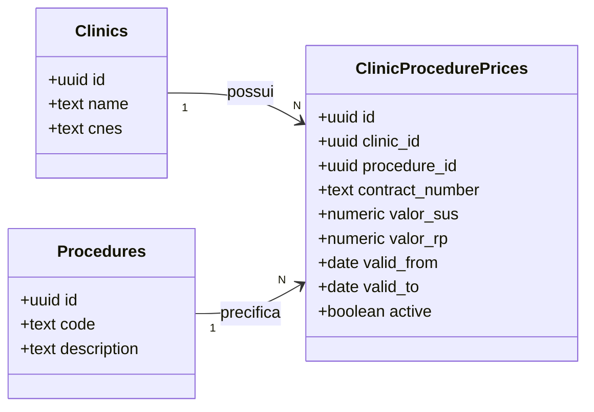
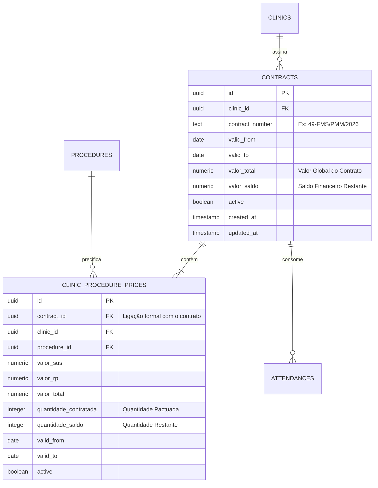
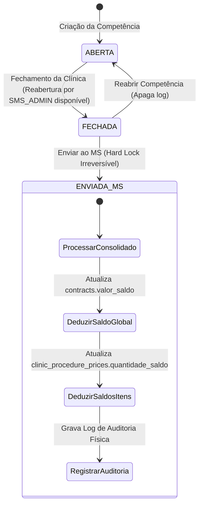

# Estudo Técnico e Plano de Ação: Controle de Saldos de Contratos e Itens

Este documento apresenta uma análise detalhada da arquitetura do **SisTEA** para atender à demanda de controle de saldo financeiro (valor global do contrato) e saldo de consumo operacional (quantidade contratada de cada procedimento) vinculados às competências de faturamento homologadas junto ao Ministério da Saúde.

> [!IMPORTANT]
> **Premissa de Governança:** Como de praxe, nenhuma alteração de código ou banco de dados será executada nesta etapa. Este documento destina-se puramente ao alinhamento de requisitos, arquitetura e planejamento.

---

## 1. Introdução e Contexto do Problema

Atualmente, o **SisTEA** gerencia os preços de procedimentos por clínica usando a tabela `clinic_procedure_prices`, agrupados pelo campo textual `contract_number`. No entanto:
1. **Falta de Entidade Global:** Não existe uma tabela formal de contratos. Os dados globais do contrato (como vigência e clínica) são repetidos de forma redundante em cada linha de preço de procedimento.
2. **Sem Controle de Saldo Global:** Não há registro do **Valor Total Pactuado** nem do **Saldo de Valor Disponível** no nível do contrato.
3. **Sem Controle de Teto por Item:** Não há registro da **Quantidade de Frequências Contratadas** nem do **Saldo de Frequências Disponíveis** para cada procedimento individual.
4. **Trigger de Dedução Específico:** A dedução do saldo **só pode ocorrer** quando a competência (faturamento) é finalizada e enviada ao Ministério da Saúde (status `'ENVIADA_MS'`), marcando o fechamento fiscal irrevogável (Hard Lock) daquela produção.

---

## 2. Diagnóstico da Arquitetura Atual

No modelo atual, a relação lógica de contratos é implícita:



### O Desafio de Normalização (3NF)
Se adicionássemos `valor_total` e `valor_saldo` diretamente em `clinic_procedure_prices`, violaríamos a Terceira Forma Normal (3NF). Se um contrato possui 10 procedimentos ativos, teríamos 10 registros repetindo o mesmo "valor total do contrato". Atualizar o saldo exigiria atualizar 10 linhas em uma transação pesada e altamente suscetível a inconsistências (split-brain).

---

## 3. Nova Modelagem de Banco de Dados Proposta

Para uma arquitetura limpa, resiliente e escalável, propomos a criação de uma tabela dedicada de `contracts` e o enriquecimento de `clinic_procedure_prices` para funcionar como os itens do contrato:



### Proposta de Migração SQL (Zero-Downtime)

A migração foi desenhada com **retrocompatibilidade absoluta**. Ela cria o novo modelo, gera os contratos agregados a partir dos registros existentes de `clinic_procedure_prices`, preenche a chave estrangeira e mantém a integridade do histórico do SisTEA.

```sql
-- 1. Criar a nova tabela de Contratos
CREATE TABLE public.contracts (
    id UUID PRIMARY KEY DEFAULT gen_random_uuid(),
    clinic_id UUID NOT NULL REFERENCES public.clinics(id) ON DELETE CASCADE,
    contract_number TEXT NOT NULL,
    valid_from DATE NOT NULL,
    valid_to DATE,
    valor_total NUMERIC(12, 2) NOT NULL DEFAULT 0,
    valor_saldo NUMERIC(12, 2) NOT NULL DEFAULT 0,
    active BOOLEAN NOT NULL DEFAULT true,
    created_at TIMESTAMP WITH TIME ZONE DEFAULT timezone('utc'::text, now()) NOT NULL,
    updated_at TIMESTAMP WITH TIME ZONE DEFAULT timezone('utc'::text, now()) NOT NULL,
    CONSTRAINT unique_clinic_contract UNIQUE (clinic_id, contract_number)
);

-- Habilitar Row Level Security (RLS) seguindo o padrão rígido do SisTEA
ALTER TABLE public.contracts ENABLE ROW LEVEL SECURITY;

CREATE POLICY "Admin full access contracts" 
ON public.contracts FOR ALL USING (public.get_user_role() = 'SMS_ADMIN');

CREATE POLICY "Users view own contracts" 
ON public.contracts FOR SELECT USING (clinic_id = public.get_user_clinic_id());

-- 2. Alterar a tabela clinic_procedure_prices para associar com o contrato e adicionar limites
ALTER TABLE public.clinic_procedure_prices
ADD COLUMN contract_id UUID REFERENCES public.contracts(id) ON DELETE SET NULL,
ADD COLUMN quantidade_contratada INTEGER NOT NULL DEFAULT 0,
ADD COLUMN quantidade_saldo INTEGER NOT NULL DEFAULT 0;

-- 3. Script de Migração de Dados Existentes
DO $$
DECLARE
    rec RECORD;
    v_contract_id UUID;
    v_valid_from DATE;
    v_valid_to DATE;
BEGIN
    -- Agrupar preços antigos por clínica e número do contrato para criar as entidades pai correspondentes
    FOR rec IN 
        SELECT DISTINCT clinic_id, contract_number 
        FROM public.clinic_procedure_prices 
        WHERE contract_number IS NOT NULL AND contract_number <> ''
    LOOP
        -- Extrair limites temporais dos itens para herança de datas
        SELECT MIN(valid_from), MAX(valid_to)
        INTO v_valid_from, v_valid_to
        FROM public.clinic_procedure_prices
        WHERE clinic_id = rec.clinic_id AND contract_number = rec.contract_number;

        -- Inserir contrato pai (saldos e totais iniciam em zero e serão preenchidos pela gestão)
        INSERT INTO public.contracts (clinic_id, contract_number, valid_from, valid_to, valor_total, valor_saldo, active)
        VALUES (
            rec.clinic_id, 
            rec.contract_number, 
            COALESCE(v_valid_from, CURRENT_DATE), 
            v_valid_to, 
            0.00, 
            0.00, 
            true
        )
        RETURNING id INTO v_contract_id;

        -- Associar os itens de preço ao novo contrato pai
        UPDATE public.clinic_procedure_prices
        SET contract_id = v_contract_id
        WHERE clinic_id = rec.clinic_id AND contract_number = rec.contract_number;
    END LOOP;
END $$;
```

---

## 4. Regras de Negócio e Lógica de Dedução

> [!WARNING]
> **Trigger Crítico:** A dedução do saldo de contratos e itens **não** deve acontecer a cada frequência realizada ou validada individualmente. Ela é um evento de consolidação fiscal mensal e só será disparada quando o administrador executar o **Envio ao Ministério da Saúde** (`status = 'ENVIADA_MS'`), pois esse evento ativa o **Hard Lock** da competência (impedindo novas criações, edições ou exclusões).

### O Fluxo de Transição Fiscal



### Algoritmo de Dedução na Server Action `sendToMSCompetenceAction`

Quando o endpoint `sendToMSCompetenceAction` for executado (em `src/app/dashboard/competences/actions.ts`), a transação do banco de dados irá realizar a consolidação:

1. **Obter a Competência e a Clínica:**
   `month_year` do faturamento é definido como `"MM/YYYY"` (exemplo: `"05/2026"`).
2. **Agrupar Produção Faturada:**
   Buscar todas as frequências da clínica daquela competência cuja situação está homologada:
   ```sql
   SELECT procedure_id, SUM(quantity) as total_qty, SUM(value_applied) as total_val
   FROM public.attendances
   WHERE clinic_id = :clinic_id 
     AND month_year = :month_year 
     AND status = 'Realizada'
   GROUP BY procedure_id;
   ```
3. **Localizar Contrato Vigente:**
   Encontrar o contrato ativo correspondente ao período da competência.
4. **Atualizar Saldos de Forma Atômica (Transação SQL):**
   - **Contrato:**
     `valor_saldo = valor_saldo - SUM(total_val)`
   - **Itens do Contrato (`clinic_procedure_prices`):**
     Para cada `procedure_id`, deduzir:
     `quantidade_saldo = quantidade_saldo - total_qty`
5. **Gravar Rastro Auditável:**
   Inserir na tabela `audit_logs` os valores deduzidos para fins forenses.

---

## 5. Sugestões de Melhoria e UX (Diferenciais do Antigravity)

Para que a solução não seja apenas reativa (que apenas informa o saldo depois do problema já ter acontecido), sugerimos três melhorias estratégicas de UX e de regras de validação:

### Sugestão 1: Saldo Oficial vs. Saldo Projetado (Crucial!)

Se deduzirmos o saldo **apenas** quando a competência for enviada ao MS, a clínica poderá cadastrar frequências infinitas durante o mês sem saber que ultrapassou o teto, descobrindo o estouro apenas no fechamento mensal.

> [!TIP]
> **Diferenciação Metodológica:**
> * **Saldo Oficial:** Valor consolidado apenas em competências com status `'ENVIADA_MS'`.
> * **Saldo Projetado / Estimado:** `Saldo Oficial - Produção em Aberto/Fechada (Ainda não enviada ao MS)`.

Apresentaremos na interface gráfica ambos os valores:
* **Saldo Oficial:** `R$ 80.000,00`
* **Saldo Projetado (Com base no que está sendo digitado neste mês):** `R$ 68.500,00`

### Sugestão 2: Trava Proativa de Cadastro (BR-011)
Durante a digitação do atendimento (em `createAttendanceAction` e `updateAttendanceAction`), o sistema fará uma validação dinâmica:
* **Se a quantidade projetada** do procedimento no mês atual + meses anteriores em aberto exceder a `quantidade_saldo` oficial do item contratual, o sistema exibirá um aviso ou impedirá a inclusão.
* Isso evita que a clínica gaste horas digitando frequências de pacientes que o município não terá saldo contratual para pagar.

### Sugestão 3: Painel de Indicadores Visuais na Tela de Contrato

Substituir a tabela simples por barras de progresso visual (estilo *Thermometer Chart* ou *Progress bar* em gradiente) mostrando o consumo financeiro global e o consumo físico de cada procedimento.

---

## 6. Plano de Implementação (Faseado)

Propomos dividir a implementação em 5 etapas bem delineadas para mitigar riscos de regressão no faturamento active:

### Fase 1: Camada de Dados (Database & Migrations)
* Criação do arquivo de migração `supabase/migrations/<timestamp>_add_contracts_table_and_balances.sql` contendo o DDL e o script de migração automática do histórico.
* Execução das DDLs no banco de dados Supabase e verificação dos logs de migração.

### Fase 2: Regras e Operações Server-Side
* Atualização de `src/app/dashboard/contracts/actions.ts`:
  * Alterar `saveContractBulkAction` para criar o registro formal na tabela `contracts` e seus itens relacionados em `clinic_procedure_prices`.
* Criação da lógica de consolidação fiscal e atualização de saldos dentro della Server Action `sendToMSCompetenceAction` em `src/app/dashboard/competences/actions.ts`.

### Fase 3: Validações Proativas (Bloqueios e Regras de Negócio)
* Implementar a função `validateContractBalanceLimit` em `src/app/dashboard/attendances/actions.ts`.
* Inserir validação preventiva contra o estouro de saldo projetado de quantidade e valor global durante a criação/edição de atendimentos.

### Fase 4: Interface do Usuário (UI/UX)
* **Tela de Contratos (`ContractForm.tsx` & `page.tsx`):**
  * Adicionar campos no cabeçalho: "Valor Total do Contrato" e mostrar o "Saldo Atual de Valor".
  * Adicionar na Tabela de Procedimentos: coluna "Quantidade Contratada" e "Saldo da Quantidade".
  * Incluir barras de progresso elegantes com gradientes HSL (verde para margem segura, amarelo para limite próximo, vermelho para estouro).
* **Filtros e Visualização:**
  * Atualizar a tabela de listagem de contratos (`page.tsx`) para incluir colunas com os saldos gerais das clínicas de forma consolidada.

### Fase 5: Homologação e Testes
* Testar fluxos de:
  1. Criação de novo contrato com valores globais e limites individuais.
  2. Lançamento de atendimentos até atingir o limite projetado (verificar o alerta).
  3. Fechamento de competência e envio ao MS (verificar se os saldos oficial e projetado foram devidamente atualizados).
  4. Validação de logs na tabela de auditoria para fins de compliance.

---

## 7. Próximos Passos e Discussão

Gostaríamos de validar com você os seguintes pontos para calibrar o plano antes da implementação:
1. **O que fazer em caso de estouro na homologação?** Se a clínica ultrapassar o teto físico de um item no mês (antes da trava preventiva ser ativada para dados retroativos), o saldo deve ficar negativo no banco ou devemos bloquear o envio ao MS até que a clínica remova/glose o excedente?
2. **Reajuste Contratual (Aditivos):** Quando um contrato é aditivado (novo valor total ou novas quantidades), devemos atualizar o mesmo registro de contrato ou criar um novo registro com vigências complementares? *(Nossa recomendação é manter vigências complementares em novos registros para preservar a rastreabilidade histórica completa).*

Aguardamos seu feedback sobre este estudo e sugestões para darmos o próximo passo!
