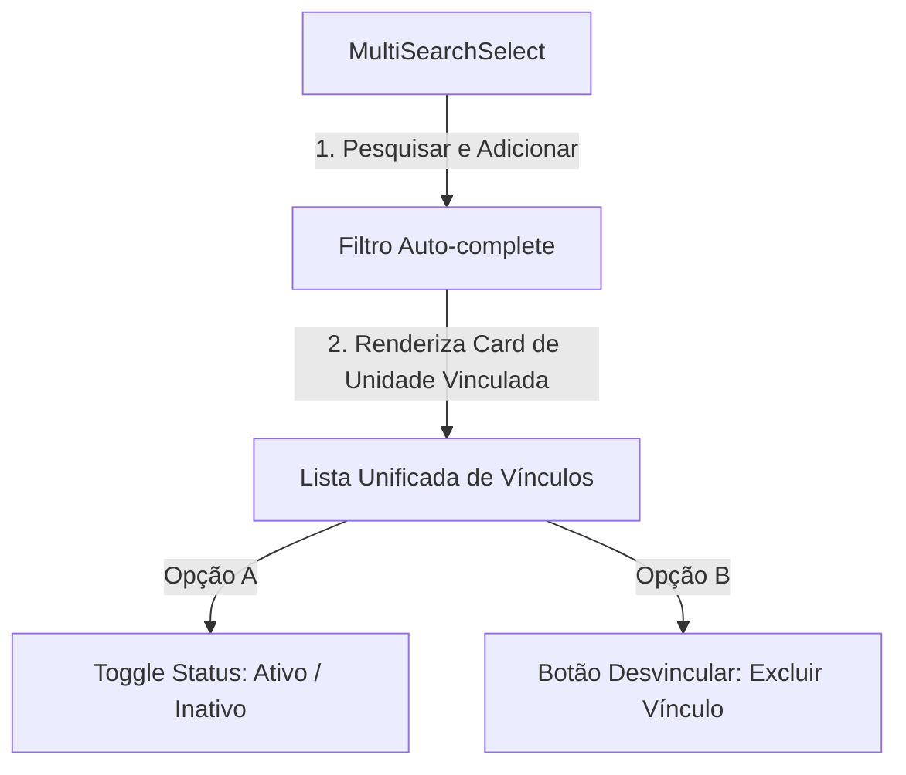

# Plano de Padronização de Vínculos de Clínicas (Profissionais & Pacientes)

Este documento consolidado apresenta o **plano de engenharia conceitual, o padrão corporativo de UI/UX/Arquitetura e o walkthrough de desenvolvimento técnico** adotados para unificar a forma de vincular profissionais e pacientes a clínicas no sistema **SisTEA**.

---

## 📅 Histórico de Evolução Técnica
*   **Fase 1 (Mapeamento Conceitual):** Detecção de divergências de interface (busca autocomplete dinâmica no cadastro de profissional vs. dropdown único limitador com toggle de status no cadastro de paciente).
*   **Fase 2 (Definição do Padrão Corporativo):** Formalização das diretrizes estruturais de banco de dados N:N, regras de governança de segurança por perfil e layout horizontal premium de cards.
*   **Fase 3 (Implementação & Walkthrough):** Execução prática das migrações do Supabase, refatorações de Server Actions no Next.js e liberação da reatividade bidirecional nos formulários.

---

## 🔍 1. Análise do Estado Atual e Problema
Atualmente, o sistema possui duas abordagens distintas para a mesma relação lógica (um profissional com clínicas e um paciente com clínicas). O objetivo é adotar a melhor experiência de ambos: **a busca e multi-seleção fluida do profissional** com a **capacidade de habilitar/suspender e remover o vínculo do paciente**.

### Cadastro de Profissional (Antigo)
*   **Interface**: Utilizava o componente `MultiSearchSelect` permitindo buscar e vincular **múltiplas clínicas** por meio de um campo autocomplete. Os vínculos selecionados apareciam como pequenas tags de texto estáticas embaixo do input.
*   **Limitação**: Não permitia ativar ou desativar o vínculo individual de uma clínica (somente excluir o vínculo por completo).
*   **Banco de Dados**: Tabela `public.professional_clinics` possuía apenas as colunas `professional_id` e `clinic_id` como PK conjunta, sem controle de status ativo/inativo para o vínculo individual.

### Cadastro de Paciente (Antigo)
*   **Interface**: Apresentava um `<select>` (dropdown clássico) que limitava o paciente a se vincular a **apenas uma clínica** principal de atendimento. Abaixo, renderizava uma lista elegante chamada "Status por Unidade" com um switch (Toggle) indicando se o atendimento estava "Habilitado" ou "Suspenso".
*   **Limitação**: A UI de seleção via `<select>` não tinha campo de pesquisa autocomplete e restringia a usabilidade de multi-clínicas.
*   **Banco de Dados**: Tabela `public.patient_clinics` possuía um controle robusto de múltiplos vínculos com as colunas `patient_id`, `clinic_id`, e `active` (BOOLEAN). A tabela `public.patients` possuía uma coluna `clinic_id` como referência de compatibilidade.

---

## 📐 2. Padrão Corporativo e Proposta UX/UI Unificada

Para criar uma experiência **100% homogênea**, estabelecemos o padrão oficial de interface e arquitetura:



### Layout Visual da Interface
```
┌────────────────────────────────────────────────────────┐
│  Unidade/Clínica de Atendimento *                      │
│  [ Pesquisar por nome da clínica... (Autocomplete) ]   │
└────────────────────────────────────────────────────────┘
  Status por Unidade:
  ┌──────────────────────────────────────────────────────┐
  │ 🏢 CLINICA ALFA                [Toggle]  [Lixeira]   │
  │    Atendimento Habilitado                            │
  └──────────────────────────────────────────────────────┘
  ┌──────────────────────────────────────────────────────┐
  │ 🏢 CLINICA BETA                [Toggle]  [Lixeira]   │
  │    Atendimento Suspenso nesta unidade                │
  └──────────────────────────────────────────────────────┘
```

### Detalhes Visuais do Card de Vínculo Unificado:
Cada clínica selecionada no autocomplete (tanto para Profissional quanto para Paciente) será renderizada abaixo do campo de pesquisa como um card horizontal elegante:
*   **Ícone visual**: Ícone de prédio/clínica (`Building`) à esquerda, com cor destacada se ativo e cinza se suspenso.
*   **Nome**: Nome da clínica em negrito e destaque em caixa alta (`uppercase tracking-tight`).
*   **Status dinâmico**: Subtítulo em tempo real ("Atendimento Habilitado" ou "Atendimento Suspenso nesta unidade").
*   **Controles do vínculo**:
    *   Um **Switch elegante (Toggle)** para ativar/desativar o vínculo.
    *   Um **Botão de exclusão (Lixeira/X)** para desvincular a clínica daquele cadastro de forma definitiva.

---

## 🏗️ 3. Padrão de Arquitetura de Software

A arquitetura robusta de múltiplos vínculos é dividida em três camadas claras:

### A. Banco de Dados (Esquema Relacional)
Toda relação de múltiplos vínculos deve utilizar uma tabela associativa com, no mínimo, as seguintes colunas:
```sql
CREATE TABLE public.entidade_vinculos (
    id UUID PRIMARY KEY DEFAULT gen_random_uuid(),
    entidade_id UUID REFERENCES public.entidades(id) ON DELETE CASCADE,
    vinculo_id UUID REFERENCES public.vinculos(id) ON DELETE CASCADE,
    active BOOLEAN DEFAULT true NOT NULL,
    created_at TIMESTAMP WITH TIME ZONE DEFAULT timezone('utc'::text, now()) NOT NULL,
    UNIQUE(entidade_id, vinculo_id)
);
```

### B. Server Actions (Controle e Sincronismo)
Duas operações cruciais devem ser disponibilizadas nas Server Actions:
1.  **Sincronismo Inteligente (Upsert/Delete)**: Ao salvar a entidade principal, a action deve comparar a lista enviada com a existente no banco:
    *   **Inserir**: Novos vínculos são cadastrados com o status ativo padrão.
    *   **Manter**: Vínculos existentes são mantidos, **preservando estritamente** o status `active` configurado anteriormente (evitando resets acidentais).
    *   **Excluir**: Vínculos que não estão mais presentes no envio são removidos.
2.  **Atualização Instantânea (Toggle Action)**: Uma action dedicada a inverter o valor da coluna `active` no banco de dados, chamada em tempo real ao clicar no switch (otimizando a performance e evitando a necessidade de clicar em "Salvar" no formulário principal).

### C. Estado Reativo no Frontend (React Hook Form)
No formulário de cadastro:
*   O estado reativo local da lista de cards (`localLinkedClinics`) deve ser sincronizado com o campo de array do formulário (`clinic_ids`) através de um `useEffect`.
*   **Fluxo de Edição**: Alterações no Toggle Switch chamam a action instantânea de atualização no banco e atualizam o estado local.
*   **Fluxo de Criação**: Alterações no Toggle Switch e na lixeira alteram exclusivamente o estado reativo local na tela, enviando a configuração consolidada no envio do formulário.

### 🔒 D. Governança e Regras de Acesso
*   **Nível SMS_ADMIN (Administrador)**: Acesso total para pesquisar, vincular novas entidades, alterar status de qualquer vínculo e remover associações através da lixeira.
*   **Nível CLINIC_USER / Outros (Usuários de Unidade)**: Exibição estritamente limitada ao vínculo da sua própria unidade de origem. O autocomplete de pesquisa deve ser ocultado. O Toggle Switch é visível apenas se houver permissão explícita para alterar o status da entidade na sua unidade, mas a lixeira e a adição de novos vínculos são bloqueadas.

### 🔄 E. Padrão de Retrocompatibilidade (Fallback)
Para garantir a compatibilidade com sistemas legados, relatórios ou integrações externas que exijam um ID de vínculo único (ex: a coluna `clinic_id` na tabela `patients`), o formulário e as actions devem:
1.  **No Formulário**: Sincronizar o campo legado `clinic_id` com o primeiro elemento selecionado do array de múltiplos vínculos (`clinic_ids[0]`).
2.  **Na Action**: Gravar automaticamente o primeiro ID selecionado na coluna legada da tabela principal ao persistir as informações, servindo como a "unidade primária" da entidade.

---

## 🛠️ 4. Walkthrough de Implementação Técnica

### Passo 1: Migração do Banco de Dados
Adicionamos a coluna `active` na tabela de vínculos dos profissionais para permitir a persistência do status de cada clínica individualmente.
```sql
ALTER TABLE public.professional_clinics 
ADD COLUMN IF NOT EXISTS active BOOLEAN DEFAULT true;
```

### Passo 2: Componente de UI Reutilizável
No componente [MultiSearchSelect.tsx](file:///c:/Users/Cliente/Projetos/SisTEA/src/components/ui/MultiSearchSelect.tsx), adicionamos a propriedade opcional `renderTags?: boolean` (padrão `true`). Isso permite ocultar as tags padrão do autocomplete quando o design exige uma renderização personalizada, como a nossa elegante lista de cards de vínculos abaixo do input de busca.

### Passo 3: Cadastro de Profissionais (`ProfessionalForm.tsx`)
1.  **Server Actions**: Refatoramos o [actions.ts (Profissional)](file:///c:/Users/Cliente/Projetos/SisTEA/src/app/dashboard/professionals/actions.ts):
    *   O método de salvamento foi otimizado para preservar o status `active` das clínicas existentes, evitando resets indesejados.
    *   Criamos a action `toggleProfessionalClinicStatusAction` para atualizar o status ativo/inativo instantaneamente via banco de dados ao clicar no switch.
2.  **Interface & Páginas**:
    *   Editamos [[id]/page.tsx (Profissional)](file:///c:/Users/Cliente/Projetos/SisTEA/src/app/dashboard/professionals/%5Bid%5D/page.tsx) para buscar e repassar a propriedade `linkedClinics` pré-carregada do banco.
    *   Implementamos reatividade bidirecional entre o `clinic_ids` (do hook form) e o estado local `localLinkedClinics`.
    *   Removemos as tags padrão do autocomplete e exibimos cards horizontais sofisticados com o ícone de clínica, nome em caixa alta, subtexto de status, botão Toggle Switch e lixeira para remoção instantânea.

### Passo 4: Cadastro de Pacientes (`PatientForm.tsx`)
1.  **Schema de Validação**: No [schema.ts (Paciente)](file:///c:/Users/Cliente/Projetos/SisTEA/src/app/dashboard/patients/schema.ts), alteramos a regra de validação para permitir múltiplos IDs de clínica: `clinic_ids: z.array(z.string().uuid())`. Mantivemos o campo `clinic_id` original como opcional para assegurar compatibilidade retroativa.
2.  **Server Actions**: No [actions.ts (Paciente)](file:///c:/Users/Cliente/Projetos/SisTEA/src/app/dashboard/patients/actions.ts):
    *   *Sincronismo inteligente*: Refatoramos `createPatientAction` e `updatePatientAction` para sincronizar os múltiplos vínculos na tabela `patient_clinics`.
    *   *Retrocompatibilidade*: O campo principal `patients.clinic_id` é gravado automaticamente com o ID do primeiro vínculo selecionado (clínica primária). Isso garante o perfeito funcionamento de relatórios BPA legados e filtros globais.
3.  **Interface & Páginas**:
    *   Editamos [[id]/page.tsx (Paciente)](file:///c:/Users/Cliente/Projetos/SisTEA/src/app/dashboard/patients/%5Bid%5D/page.tsx) para buscar o status dos vínculos na tabela `patient_clinics` e injetar a lista mapeada de `clinic_ids` no `initialData`.
    *   Substituímos o `<select>` de clínica única pelo `MultiSearchSelect` de múltiplas clínicas (usando `renderTags={false}`).
    *   Implementamos reatividade idêntica: a seleção ou remoção no autocomplete adiciona/remove dinamicamente os cards de clínica na parte inferior.
    *   Mantivemos a restrição de segurança: Usuários do tipo clínica (`CLINIC_USER`) visualizam apenas o card único e fixo da sua clínica, enquanto administradores (`SMS_ADMIN`) gerenciam múltiplos vínculos.

---

## 📋 Critérios de Aceitação e Validação
*   [x] **Homogeneidade**: Ambas as telas (`ProfessionalForm.tsx` e `PatientForm.tsx`) utilizam exatamente a mesma abordagem visual (autocomplete `MultiSearchSelect` + cards com toggle de status e botão de remoção).
*   [x] **Controle Granular**: É possível ativar ou desativar o vínculo de qualquer clínica de forma isolada tanto para profissionais quanto para pacientes em tempo real.
*   [x] **Integridade do Banco**: O status ativo/inativo de cada clínica é corretamente persistido no Supabase nas respectivas tabelas `professional_clinics` e `patient_clinics`.
*   [x] **Retrocompatibilidade**: A tabela legada de pacientes (`patients.clinic_id`) continua recebendo a clínica de referência principal para garantir o funcionamento correto de relatórios e exportações já existentes.
