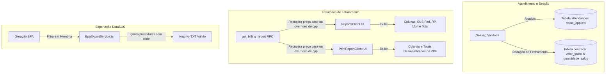

# Plano de Implementação: Gestão de Procedimentos Sem Código (Recurso Próprio)

Este documento detalha o plano de implementação minucioso para o suporte e gestão de procedimentos sem código SUS no sistema **SisTEA**. Esses procedimentos representam tratamentos custeados integralmente com **Recursos Próprios (RP)** do município e não devem ser exportados nos arquivos do **BPA (Boletim de Produção Ambulatorial)**, mas devem ser faturados, monitorados no saldo do contrato e detalhados nos relatórios com o devido desmembramento financeiro.

---

## 1. Objetivos Estratégicos

1. **Garantir a Conformidade do BPA (DataSUS)**: Excluir totalmente os procedimentos sem código (onde `code IS NULL` ou `code = ''`) da geração e da validação pré-flight do arquivo BPA para evitar rejeições no validador do Ministério da Saúde.
2. **Desmembramento Financeiro no Faturamento**: Exibir explicitamente nos relatórios do dashboard e de impressão as parcelas de financiamento:
   - **Recurso Federal**: Correspondente ao valor repassado pelo SUS (baseado em `valor_sus`).
   - **Recurso Próprio (Municipal)**: Correspondente ao valor co-financiado ou custeado pelo município (baseado em `valor_rp`).
   - **Valor Total**: A soma consolidada das duas fontes (`valor_sus + valor_rp`).
3. **Preservação de Saldos e Contratos**: Garantir que a utilização de procedimentos sem código continue consumindo normalmente os saldos e as quantidades dos contratos das clínicas, sem gerar inconsistências.
4. **Segurança e Estabilidade**: Assegurar que as mudanças não quebrem regras de negócio, fechamento de competências ou concorrência.

---

## 2. Arquitetura da Solução



---

## 3. Detalhamento Técnico das Modificações

### A. Banco de Dados (RPC `get_billing_report`) - **[CONCLUÍDO]**
As funções de relatório de faturamento foram atualizadas para buscar tanto os valores padrão (`procedures`) quanto as tabelas de overrides contratuais (`clinic_procedure_prices`), desmembrando:
- `valor_sus` (Federal)
- `valor_rp` (Municipal)
- `value` (Total consolidado)

### B. Exportador BPA (`BpaExportService.ts`)
Garantiremos que os procedimentos sem código SUS cadastrados não causem erros de validação nem integrem o arquivo de transmissão ao Ministério da Saúde.
- **Filtro em Memória**: Em `validateExport` e `generateTxt`, filtraremos a lista de atendimentos recuperados descartando qualquer registro cujo código do procedimento (`procedures.code`) esteja nulo ou em branco.
- Isso previne erros do tipo `Procedimento sem Código SUS` durante a verificação pré-flight.

### C. Interface do Dashboard (`ReportsClient.tsx`)
Aprimoraremos a tabela de faturamento para separar visualmente as fontes de recursos e totalizar de maneira elegante.
- **Colunas**:
  - `SUS (Federal)` (com base no `valor_sus` individual da sessão)
  - `RP (Municipal)` (com base no `valor_rp` individual da sessão)
  - `Total` (com base no `value` individual)
- **Rodapé (Footers)**:
  - Adição de somatórios individuais para `SUS (Federal)` e `RP (Municipal)`.
  - Manutenção do somatório principal em destaque com a cor primária do sistema.

### D. Layout de Impressão (`PrintReportClient.tsx`)
O relatório impresso (PDF oficial de faturamento) deve refletir exatamente as mesmas métricas consolidadas.
- **Colunas**:
  - `SUS (Fed.)`
  - `RP (Mun.)`
  - `Total`
- **Rodapé (Footers)**:
  - Totalizadores separados de recursos próprios e recursos SUS.
  - Alinhamento estético profissional compatível com o layout de alta fidelidade do SisTEA.

---

## 4. Plano de Tarefas e Checklists de Execução

### Fase 1: Atualização do BPA Export Service
- [ ] Editar `src/lib/bpa/BpaExportService.ts`
- [ ] Aplicar o filtro de segurança na lista de atendimentos em `validateExport`:
  ```typescript
  const validAttendances = (attendances || []).filter((att: any) => att.procedures?.code && att.procedures.code.trim() !== '');
  ```
- [ ] Replicar o mesmo filtro de segurança in `generateTxt`.
- [ ] Validar que sessões sem código SUS não disparem erros pré-flight.

### Fase 2: Atualização da UI de Relatórios do Dashboard
- [ ] Editar `src/app/dashboard/reports/ReportsClient.tsx`
- [ ] Atualizar o cabeçalho da tabela do tipo `billing`/`default` para incluir `SUS (Federal)` e `RP (Municipal)`.
- [ ] Atualizar as linhas (`tbody`) para renderizar `row.valor_sus`, `row.valor_rp` e `row.value`.
- [ ] Atualizar o rodapé (`tfoot`) para somar e exibir os acumulados de recursos federais e recursos municipais separadamente.

### Fase 3: Atualização do Layout de Impressão de Relatórios
- [ ] Editar `src/app/dashboard/reports/print/PrintReportClient.tsx`
- [ ] Atualizar o objeto `totals` para incluir `susTotal` e `rpTotal`:
  ```typescript
  susTotal: data.reduce((acc, row) => acc + (Number(row.valor_sus) || 0), 0),
  rpTotal: data.reduce((acc, row) => acc + (Number(row.valor_rp) || 0), 0),
  ```
- [ ] Atualizar as colunas da tabela de faturamento para refletir `SUS (Fed.)` e `RP (Mun.)`.
- [ ] Atualizar o rodapé impresso para renderizar os totais desmembrados.

---

## 5. Protocolo de Verificação e Homologação

1. **Validação do BPA**:
   - Criar atendimentos associados a procedimentos com código e sem código na mesma competência.
   - Executar a validação pré-flight da competência no painel.
   - Garantir que apenas os atendimentos de procedimentos sem código passem sem erros (pois serão ignorados na exportação).
   - Gerar o arquivo `.TXT` e validar que as linhas de faturamento consolidadas e individualizadas pertencem exclusivamente a procedimentos que possuem códigos válidos.
2. **Auditoria de Relatórios**:
   - Acessar `Relatórios & BI` -> `Faturamento`.
   - Verificar a correta distribuição das colunas `SUS (Federal)`, `RP (Municipal)` e `Total`.
   - Garantir que a soma horizontal (`SUS + RP`) feche perfeitamente com o `Total` em cada linha.
   - Confirmar se a soma dos totais consolidados no rodapé fecha com o acumulado de faturamento geral exibido.
3. **Impressão Física (PDF)**:
   - Clicar em "PDF" e verificar a consistência dos dados exibidos no painel de visualização de impressão e a quebra de páginas.
